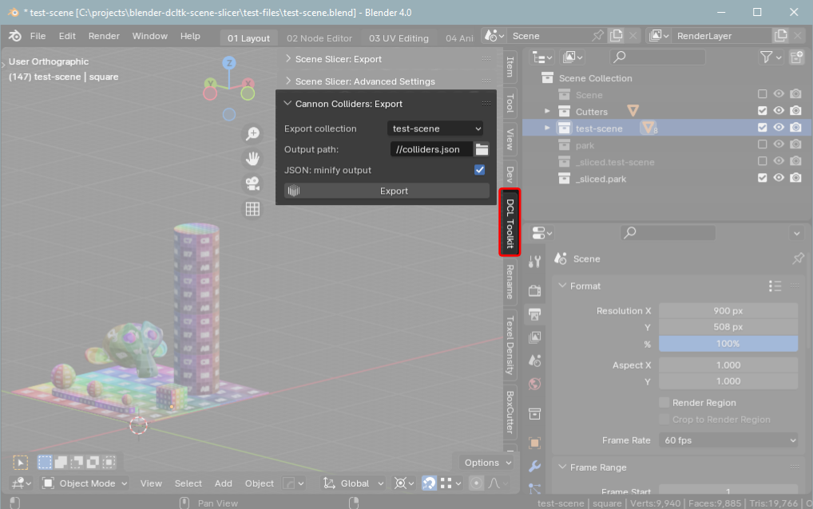

# Blender Decentraland Toolkit: Cannon Colliders


This is a Blender plugin for exporting Rigidbodies to JSON so they can be used as CannonJS colliders. The JSON file contains the relevant data required to create Box, Sphere, and Trimesh colliders.

It was written for use with the **Infinity Engine** in Decentraland - see the [Decentrally](https://github.com/decentraland-scenes/decentrally) repo for more information. An example of utilising the JSON files to create Cannon colliders in SDK7 can be found in the [dcl-cannon-colliders-example](https://github.com/stom66/dcl-cannon-colliders-example) repo.


### Features

* Export Rigidbodies as cannon colliders
* Supports Box, Sphere, and Mesh shapes
* Supports Friciton and Restitution (bounciness) values
* Supports rotated/scaled/parented objects

### See also:

* DCL SDK7 + CannonJS Example: https://github.com/stom66/dcl-cannon-colliders-example
* Infinity Engine + colliders demo: https://github.com/wacaine/dcl-infinity-engine-sdk7-template
* Decentrally Infinity Engine: https://github.com/decentraland-scenes/decentrally


Installation
--
* Download the latest version from the [Releases](https://github.com/stom66/blender-dcltk-cannon-colliders/releases) page
* In Blender, go to `Edit > Preferences > Addons > Install`
* Select the .zip file
* Once installed, ensure the plugin is activated (ticked) in the list of Addons

Once installed you can find it in `3D Viewport -> Sidebar -> DCL Toolkit -> Cannon Colliders`




How to use
---
* Place your colliders in a collection
* Give each of your colliders a **Rigidbody** in the Physics tab:
    * Set the type to Passive
    * Under "Collisions" set the Shape. Currently only "Box", "Sphere", and "Mesh" with source "Base" is supported.
    * Under "Surface Response" set both the "Friction" and "Bounciness"
* In the **DCL Toolkit** sidebar panel, under section **Cannon Colliders**: 
    * Choose your collection in the dropdown 
    * Configure output path (see below)
    * Click the "Export" button

It is recommended to enable both "Minify JSON" as "Rounding" options for production to reduce the JSON file size considerably.


Settings:
---

The following options are available in the Cannon Colliders panel: 

#### Export collection

* Choose the collection containing the Rigidbodies you wish to export
* Click the refresh symbol if your collection is not in the dropdown
* All objects in the collection **with a Rigidbody** will be exported - visbility is ignored

#### Output path
* Blender uses `//` for relative paths
* Use `//colliders.json` to output to a file in the current blend file location

#### Minify JSON
* Significantly reduces JSON export file size by omitting lines breaks and whitespace
* Disable for dev; enable for production

#### Rounding
* Trims position values to 3 decimals places - this is more than accurate enough for most situations
* Significantly reduces JSON export file size
* Enable at all times, unless raw values are required

Debugging:
---

There is a visualiser for the exported colliders to aid with debugging. See the [cannon-collider-visualiser](https://github.com/stom66/cannon-collider-visualiser) repo for more info.

#### Common problems:
* **Problem**: BOX/SPHERE collider is miss-aligned  
    **Solution**: Ensure the object's origin is at the center of its geometry
    
* **Problem**: collider is not being exported  
    **Solution**: Make sure the object:  
    * has a passive rigidbody of type BOX, SPHERE, or MESH
    * belongs to the exported collection
    * does not contain ngons (only tris or quads)
    
* **Problem**: colliders appears in the Visualiser but not in my scene  
    **Solution**: Ensure the collider type is set to PASSIVE

How does it work
--

The addon peforms roughly the following process when the "Export" button is clicked:

* Loop through all objects in the specified collection
* Check if the object has a Rigibody component
* Create an object representing the object mesh and its Rigidbody properties
* Export all objects to the specified JSON file


Collider JSON
---

> **NOTE:** Positions and indexes are in XYZ order, with Y representing the vertical (up) axis. Rotations are specified in quaternions.

The addon exports a JSON structure describing the colliders to the output file specified. By default this is `colliders.json`.

The structure is shown in this example, and a full example can be scene in the [dcl-cannon-colliders-example](https://github.com/stom66/dcl-cannon-colliders-example) repo.

```js
[

    {
        "obj_name"   : "mesh collider", // Object name
        "position"   : [4, 2, 4],       // Object position (Y+ is up)
        "type"       : "PASSIVE",       // RB type: ACTIVE or PASSIVE
        "shape"      : "MESH",          // Shape: any valid Blender RB Shape (Box, Mesh, etc) 
        "friction"   : 1.0,             // Friction value of physics material
        "restitution": 0.5,             // Bounciness value of physics material
        "mass"       : 5.0,             // Mass of object
        "vertices"   : [...],           // MESH ONLY: Array of vert positions (not in tuples)
        "indices"    : [...],           // MESH ONLY: Array of face indices (not in tuples)
    },

    {
        "obj_name"   : "box collider",
        "position"   : [ 1, 0.125, 1 ],
        "type"       : "PASSIVE",
        "shape"      : "BOX",
        "friction"   : 1.0,
        "restitution": 0.6,
        "mass"       : 1.0,
        "dimensions" : [ 2.0, 0.25, 2.0 ],            // BOX ONLY
        "rotation"   : [ -0.0, -0.707, -0.707, -0.0 ] // BOX ONLY: Quaternion, in radians
    },

    {
        "obj_name"   : "sphere collider",
        "position"   : [ 0, 1, 0 ],
        "type"       : "PASSIVE",
        "shape"      : "SPHERE",
        "friction"   : 1.0,
        "restitution": 0.95,
        "mass"       : 1.0,
        "radius"     : 2.0 // SPHERE ONLY
    },
    
    // ... etc, one object for each Rigidbody

]
```

Using the JSON: TypeScript example
---

For an example of creating Cannon colliders in an SDK7 scene, see the repository [dcl-cannon-colliders-example](https://github.com/stom66/dcl-cannon-colliders-example)

It includes examples of:

* `Collider` interface
* `colliders.json` file
* Typescript Cannon implementation for parsing and creating colliders


Known issues, limitations and caveats:
--

1) Does not apply modifiers. Exported mesh data represents the base mesh.
1) Object visibility is ignored - if it's in the collection, it gets exported
1) NGONs are not supported. The plugin will skip meshes containing ngons and show a warning


ToDo:
--
* [x] Account for scale/rotation, etc  
* [x] Convert from Z+ up to Y+ up  
* [x] Reduce JSON file size by optionally rounding positions to 3(?) decimal places  
* [x] Support shapes properly: box, sphere    
* [ ] Add support for final mesh, eg clone object and apply modifiers    