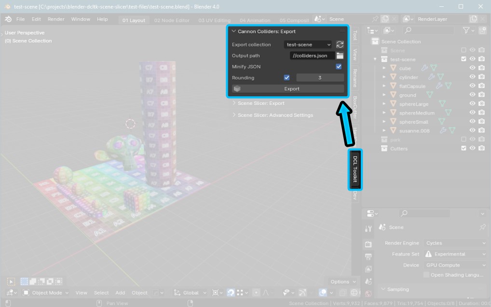

# Blender Decentraland Toolkit: Cannon Colliders

This is a Blender plugin for exporting Rigidbodies to JSON as Cannon-compatible colliders. The results are exported to a JSON file that contains the data needed to create Trimesh colliders.

It was written for use with the **Infinity Engine** in Decentraland - see the [Decentrally repository](https://github.com/decentraland-scenes/decentrally) for more information.


### Features

* Export Rigidbodies as cannon colliders

Installation
--
* Download the latest version from the [Releases](/releases) page
* In Blender, go to `Edit > Preferences > Addons > Install`
* Select the .zip file
* Once installed, ensure the plugin is activated (ticked) in the list of Addons

Once installed you can find it in `3D Viewport -> Sidebar -> DCL Toolkit -> Cannon Colliders`




How to use
---
* Place your colliders in a collection
* Give each of your colliders a **Rigidbody** in the Physics tab:
	* Set the type to Passive
	* Under "Collisions" set the Shape. Currently only "Mesh" with source "Base" is supported.
	* Under "Surface Response" set both the "Friction" and "Bounciness"
* In the **DCL Toolkit** sidebar panel, under section **Cannon Colliders**: 
    * Choose your collection in the dropdown 
    * Configure output path (see below)
    * Click the "Export" button


### Settings:

The following options are available in the Cannon Colliders panel: 

#### Export collection

* Choose the collection containing the Rigidbodies you wish to export
* Click the refresh symbol if your collection is not in the dropdown
* All objects in the collection **with a Rigidbody** will be exported - visbility is ignored

#### Output path
* Blender uses `//` for relative paths
* Use `//colliders.json` to output to a file in the current blend file location

#### JSON: minify output
* Significantly reduces JSON export file size
* Disable for dev; enable for production


How does it work
--

The addon peforms roughly the following process when the "Export" button is clicked:

* Loop through all objects in the specified collection
* Check if the object has a Rigibody component
* Create an object representing the object mesh and its Rigidbody properties
* Export all objects to the specified JSON file


Collider JSON
---

> **NOTE:** Positions and indexes are in XYZ order, with Y representing the vertical (up) axis

The addon exports a JSON structure describing the colliders to the output file specified. By default this is `colliders.json`.

The structure is shown in this example:

```js
[
    {
        "obj_name"   : "cube",    // Object name
        "position"   : [4, 2, 4], // Object position (Y+ is up)
        "vertices"   : [...],     // Array of vert positions (not in tuples)
        "indices"    : [...],     // Array of face indices (not in tuples)
        "type"       : "PASSIVE", // RB type: ACTIVE or PASSIVE
        "shape"      : "MESH",    // Shape: any valid Blender RB Shape (Box, Mesh, etc) 
        "friction"   : 1.0,       // Friction value of physics material
        "restitution": 0.5,       // Bounciness value of physics material
        "mass"       : 5.0,       // Mass of object
    },
    // ... etc, one object for each Rigidbody

]
```

Using the JSON: TypeScript example
---

For a more complete example of creating Cannon colliders see the **TODO: add link to example REPO**

A basic example of using the data with TypeScript is shown below:

```ts
interface ColliderData {
	obj_name   : string,
	position   : number[],
	vertices   : number[];
	indices    : number[];
	type       : string;
	shape      : string;
	friction   : number;
	restitution: number;
	mass       : number;
}

import colliderDataJSON from './colliders.json';

const colliderDataArray: ColliderData[] = colliderDataJSON as ColliderData[];

colliderDataArray.forEach((colliderData, index) => {
	console.log(colliderData)
	// ... rest of code for creating cannon colliders
});
```


Known issues, limitations and caveats:
--

1) Does not apply modifiers. Exported mesh data represents the base mesh.
1) Object visibility is ignored - if it's in the collection, it gets exported

ToDo:
--
[x] Account for scale/rotation, etc
[x] Reduce JSON file size by optionally rounding positions to 3(?) decimal places
[ ] Support shapes properly: box, sphere  
[ ] Add support for final mesh, eg clone object and apply modifiers  